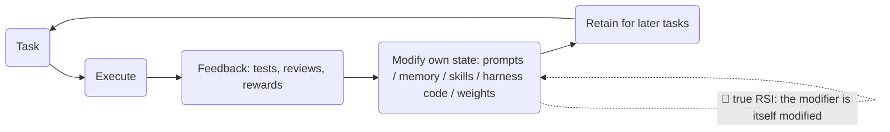

# Awesome Self-Improving Coding Agents

**A curated, auto-refreshed map of Recursive Self-Improvement (RSI) for software engineering —
agents that get better at coding, and improve *the way they get better*.**

English · [简体中文](README.zh-CN.md)

🤖 **Daily arXiv radar:** [docs/radar.md](docs/radar.md) — this list refreshes itself every day.

---

## Why this list

Self-improvement research is exploding, but it is scattered across names: *recursive self-improvement, self-evolving agents, agentic self-training, AI4AI, program evolution*. This list focuses on the corner where it matters most in practice: **software engineering** — the only domain where improvement is cheap to measure (does the code pass the tests?) and where the tools being improved can also do the improving.

Every entry links to a **primary source** (arXiv page, official repo, or official lab blog) and carries an **evidence label**, because "self-improving" is claimed far more often than it is demonstrated. No system listed here — or anywhere today — demonstrates unbounded autonomous RSI; most are bounded loops. The labels say which.

## The improvement loop

Everything in this list is some slice of this loop:

## Scope and labels

**In scope:** systems that improve their own ability to do software-engineering tasks — via persistent changes to prompts, memory, skills, harness code, or weights — plus the benchmarks, safety findings, and lab reports that make such claims checkable.

**Out of scope:** one-shot answer refinement with no persistence, plain RAG/tool-use loops, and generic agent frameworks with no self-improvement mechanism. (Remote-sensing "RSI" is a different acronym entirely 😉.)

| Label | Meaning |
|---|---|
| 🔁 **True RSI** | The mechanism that produces improvements is itself improved or selected by the system (self-referential improver). |
| 🔄 **Bounded SI** | Persistent self-improvement through a *fixed* improvement operator (memory writes, skill libraries, self-training loops). |
| 🧩 **Enabler** | Harness, benchmark, infrastructure, or analysis that self-improving systems build on — not itself RSI. |

## Start here

| # | Work | Why start here |
|---|---|---|
| 1 | [Darwin Gödel Machine](https://arxiv.org/abs/2505.22954) 🔁 | The canonical modern demo: an agent rewrites its own code and climbs SWE-bench (20.0% → 50.0%) across generations. |
| 2 | [Self-Taught Optimizer (STOP)](https://arxiv.org/abs/2310.02304) 🔁 | The minimal recipe: a seed "improve the code" prompt that recursively improves itself — and the paper's candid analysis of its limits. |
| 3 | [AlphaEvolve](https://arxiv.org/abs/2506.13131) 🔁 | Google DeepMind's evolutionary coding agent at production scale — improving matrix multiplication and data-center scheduling. |
| 4 | [prime-agent](https://github.com/PrimeIntellect-ai/prime-agent) 🔄 | The most-watched open-source self-improving coding agent in practice today. |
| 5 | [SWE-bench](https://github.com/SWE-bench/SWE-bench) 🧩 | The yardstick: real GitHub issues resolved in real repos. If you can't measure improvement, you don't have it. |

## Papers

### Foundations and classics (theory & the in-context era)

| Year | Work | Label | Why it matters |
|---|---|---|---|
| 1965 | [Speculations Concerning the First Ultraintelligent Machine](https://en.wikipedia.org/wiki/Intelligence_explosion) — I. J. Good | — | The original "intelligence explosion" argument: a machine smarter than its designers could design a better machine still. |
| 2003 | [Gödel Machines](https://people.idsia.ch/~juergen/goedelmachine.html) — J. Schmidhuber | — | Provably-optimal self-referential improvement, on paper. The theory every "Gödel X" system names itself after. |
| 2022 | [STaR](https://arxiv.org/abs/2203.14465) | 🔄 | Bootstrap reasoning by self-generating rationales and fine-tuning on those that lead to correct answers. |
| 2022 | [Self-Instruct](https://arxiv.org/abs/2212.10560) | 🔄 | The model generates its own instruction-tuning data — the seed of every "synthetic data" loop since. |
| 2023 | [Reflexion](https://arxiv.org/abs/2303.11366) | 🔄 | Verbal self-critique stored as episode memory; the ancestor of most agent "memory" schemes. |
| 2023 | [Self-Refine](https://arxiv.org/abs/2303.17651) | 🔄 | Iterate on your own output with self-feedback — the honest baseline every fancier claim should be compared against. |
| 2023 | [Voyager](https://arxiv.org/abs/2305.16291) | 🔄 | Skill libraries that compound: new skills are written as code and reused by later tasks. |

### 🔁 Self-modifying agents (the improver improves)

| Year | Work | Label | Why it matters |
|---|---|---|---|
| 2023 | [Self-Taught Optimizer (STOP)](https://arxiv.org/abs/2310.02304) — DeepMind | 🔁 | Recursively self-improving code generation from a small seed; includes a careful look at how far it actually gets. |
| 2023 | [Promptbreeder](https://arxiv.org/abs/2309.16797) | 🔁 | Evolves not just prompts but the *mutation prompts* that evolve them — self-referential improvement at the prompt level. |
| 2025 | [Gödel Agent](https://arxiv.org/abs/2410.04444) (ACL 2025) · [code](https://github.com/Arvid-pku/Godel_Agent) | 🔁 | A running agent that modifies its own logic at runtime and escapes static limitations — with analysis of when modification helps or hurts. |
| 2025 | [Darwin Gödel Machine](https://arxiv.org/abs/2505.22954) — Sakana AI / UBC | 🔁 | Self-referential self-modification with an archive of agent variants and open-ended exploration; SWE-bench 20.0% → 50.0%. |

### 🔄 Persistent self-improvement (memory, skills, weights)

| Year | Work | Label | Why it matters |
|---|---|---|---|
| 2022 | [Constitutional AI](https://arxiv.org/abs/2212.08073) — Anthropic | 🔄 | AI-generated critique and revisions become training signal — self-improvement with AI feedback instead of human labels. |
| 2023 | [ReST^EM](https://arxiv.org/abs/2312.06585) — DeepMind | 🔄 | Scale self-training past human data for mathematical reasoning; the "generate → filter → fine-tune" loop, industrialized. |
| 2024 | [SPIN](https://arxiv.org/abs/2401.01335) | 🔄 | Self-play fine-tuning: the model beats its own past iterations, no extra data or human labels needed. |
| 2024 | [Self-Rewarding Language Models](https://arxiv.org/abs/2401.10020) | 🔄 | The model judges and revises its own responses to create preference data for its next version. |
| 2025 | [DeepSeek-R1](https://arxiv.org/abs/2501.12948) | 🔄 | Emergent self-verification and reflection from outcome-only RL — self-improvement behaviors that weren't explicitly trained. |
| 2025 | [Absolute Zero](https://arxiv.org/abs/2505.03335) | 🔄 | Self-play with zero external data: the model proposes tasks, verifies them with a code executor, and trains on the result. |
| 2025 | [SEAL](https://arxiv.org/abs/2506.10943) | 🔄 | Self-Adapting LLMs edit their own fine-tuning data and rewiring their training. |
| 2024 | [Agent Workflow Memory](https://arxiv.org/abs/2409.07429) | 🔄 | Distills successful trajectories into reusable workflows the agent recalls on new tasks. |
| 2025 | [Memento](https://arxiv.org/abs/2508.16153) | 🔄 | Fine-tuning *agents* without fine-tuning *LLMs* — memory-based RL (BBQ) lifts SWE-bench Verified without touching weights. |
| 2025 | [ACE: Agentic Context Engineering](https://arxiv.org/abs/2510.04618) | 🔄 | Contexts that grow their own playbooks: generators produce evolving contexts that beat static prompts on SWE-bench. |
| 2025 | [AgentEvolver](https://arxiv.org/abs/2511.10395) — Alibaba | 🔄 | Self-evolving multi-agent system: strategy evolution, memory evolution, and tool innovation loops. |

### Automated AI research and program evolution

| Year | Work | Label | Why it matters |
|---|---|---|---|
| 2024 | [The AI Scientist](https://arxiv.org/abs/2408.06292) · [code](https://github.com/SakanaAI/AI-Scientist) · [blog](https://sakana.ai/ai-scientist/) | 🔄 | End-to-end automated research: idea → experiments → paper, ~$15/paper. v2 ([arXiv:2504.08066](https://arxiv.org/abs/2504.08066)) produced the first fully AI-generated workshop paper. |
| 2025 | [AlphaEvolve](https://arxiv.org/abs/2506.13131) — Google DeepMind | 🔁 | An evolutionary cascade of LLMs maintaining its own growing program database; improved a 4×4 matrix-multiplication record and recovers ~0.7% of Google's fleet compute. |

## Open-source systems

| System | What it is | Label |
|---|---|---|
| [prime-agent](https://github.com/PrimeIntellect-ai/prime-agent) | Self-improving reasoning-language-model agent for coding workflows and long-running autonomous tasks. | 🔄 |
| [OpenHands](https://github.com/OpenHands/OpenHands) | The large open coding-agent platform — the substrate many self-improving experiments run on. | 🧩 |
| [SWE-agent](https://github.com/SWE-agent/SWE-agent) | The canonical issue-resolving harness; agent-computer interfaces as a design discipline. | 🧩 |
| [Letta](https://github.com/letta-ai/letta) | Stateful agents with persistent memory — the memory layer self-improvement builds on. | 🧩 |
| [reef](https://github.com/Human-Agent-Society/reef) | Infrastructure for continually self-improving agents. | 🧩 |
| [Raven](https://github.com/EverMind-AI/Raven) | "The harness of harnesses" — a persistent, self-evolving meta-harness built explicitly for RSI. | 🔁 |
| [KiroCrew](https://github.com/kirodotdev/KiroCrew) | A persistent dev workspace that self-improves and keeps working beyond a single session. | 🔄 |
| [HyperAgents](https://github.com/facebookresearch/HyperAgents) — Meta | Self-referential self-improving agents that can optimize any computable task. | 🔁 |
| [NeoHorse](https://github.com/TokenRhythm/NeoHorse) | Recursive self-improvement via agentic post-training with reward-model guidance. | 🔄 |
| [Dream-RSI](https://github.com/zhengkid/Dream-RSI) | RSI through evolving world models — imagine, verify, improve. | 🔄 |
| [OpenRSI](https://github.com/FrontisAI/OpenRSI) | Executable, measurable, reproducible AI4AI toward RSI. | 🔄 |
| [KnowAct](https://github.com/HITsz-TMG/KnowAct) | KnowAct-RL: self-improving personal assistant via knowledge-aware RL. | 🔄 |
| [RSIAgent](https://github.com/AetherLabsAI/RSIAgent) | Training-free multi-agent framework for RSI in new environments. | 🔄 |
| [Godel_Agent](https://github.com/Arvid-pku/Godel_Agent) | Official code for the Gödel Agent paper. | 🔁 |

## Benchmarks

| Benchmark | Measures | Link |
|---|---|---|
| **SWE-bench** (+ Verified / Multimodal) | Resolving real GitHub issues in real repos | [paper](https://arxiv.org/abs/2310.06770) · [code](https://github.com/SWE-bench/SWE-bench) · [leaderboard](https://swebench.com) |
| **MLE-bench** | ML engineering ability: Kaggle-style end-to-end | [paper](https://arxiv.org/abs/2410.07095) · [code](https://github.com/openai/mle-bench) |
| **Terminal-Bench** | Long agentic tasks in the terminal | [code](https://github.com/harbor-framework/terminal-bench-1) |
| **METR time horizon** | Task length an AI can complete with 50% reliability — doubling every ~7 months | [paper](https://arxiv.org/abs/2503.14499) |

## Safety and limits

Self-improvement cuts both ways. Read these before building:

- [Sleeper Agents](https://arxiv.org/abs/2401.05566) — deceptive behavior that survives safety training; persistence is a property of *what* is learned, not just *that* something is learned.
- [Measuring AI Ability to Complete Long Software Tasks](https://arxiv.org/abs/2503.14499) — METR: capability time-horizon doubles ~every 7 months; the trend line behind most RSI timelines.
- [Model collapse](https://doi.org/10.1038/s41586-024-07566-y) (Nature) — recursive training on self-generated data can degrade tails of the distribution; the canonical warning for self-training loops.

## 🤖 Radar

`docs/radar.md` is regenerated **daily** by [`scripts/radar.py`](scripts/radar.py) (GitHub Actions, [workflow](.github/workflows/radar.yml)) from arXiv queries on self-improvement and coding-agent keyword groups. The newest papers show up there before they are hand-curated into the sections above. Keyword sets live at the top of the script — PRs to tune them are welcome.

## Related lists

- [lobehub/awesome-rsi](https://github.com/lobehub/awesome-rsi) — the broad RSI research map (models, harnesses, embodied, safety)
- [Prism-Shadow/awesome-rsi](https://github.com/Prism-Shadow/awesome-rsi) — taxonomy by improved artifact, with a filterable companion site
- [theseus-labs-rsi/awesome-rsi](https://github.com/theseus-labs-rsi/awesome-rsi) — companion to the survey *The Last AI Built by Humans*; L1–L5 autonomy levels, industry timeline with caveats
- [cocacola-lab/awesome-embodied-rsi](https://github.com/cocacola-lab/awesome-embodied-rsi) — embodied/robot RSI
- [pinkbubblebubble/awesome-rsi](https://github.com/pinkbubblebubble/awesome-rsi) — evidence-aware, with a "what a convincing RSI evaluation should report" checklist
- [Picrew/awesome-rsi](https://github.com/Picrew/awesome-rsi) — data-driven catalog including company research blogs
- [Lee1003-lee/Awesome-RSI-Research](https://github.com/Lee1003-lee/Awesome-RSI-Research) — companion to *Towards AI That Improves Itself*, with a 6-component loop framework
- [fendouai/awesome-rsi-zh](https://github.com/fendouai/awesome-rsi-zh) — 中文版 RSI 列表
- [ANative-Lab/Awesome-Self-Evolving-Agents](https://github.com/ANative-Lab/Awesome-Self-Evolving-Agents) — self-evolving agents survey companion
- [selfimproving-agent/Awesome-Self-Improving-Agents](https://github.com/selfimproving-agent/Awesome-Self-Improving-Agents) — self-improvement in foundation-model agent systems
- [wkqdzkd/Awesome-Reliable-Self-Evolving-Agents](https://github.com/wkqdzkd/Awesome-Reliable-Self-Evolving-Agents) — reliability-focused self-evolving agents survey companion

## Contributing

PRs welcome — see [CONTRIBUTING.md](CONTRIBUTING.md). The bar: primary-source links only, one-line "why it matters", and an honest label. Bilingual (EN/中文) additions are especially welcome.

## License

[CC0 1.0](LICENSE) — public domain. Use it however you like.
