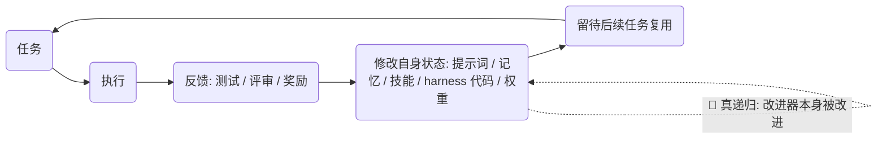

# Awesome 自改进编码智能体

**递归自我改进（RSI）× 软件工程：一份自动刷新的精选地图 ——
不仅写得更好，还改进「写得更好」的方法本身。**

[English](README.md) · 简体中文

🤖 **每日 arXiv 雷达：** [docs/radar.md](docs/radar.md) —— 本列表每天自动更新。

---

## 为什么做这个列表

自改进研究正在爆发，但散落在各种名字之下：*递归自我改进、自进化智能体、智能体自训练、AI4AI、程序进化*。本列表聚焦其中最有实践意义的角落：**软件工程**——这是唯一一个"改进"可以低成本度量的领域（代码过没过测试？），而且被改进的工具恰好也能执行改进。

每个条目只链接**一手来源**（arXiv 页面、官方仓库或官方实验室博客），并带**证据标签**——因为"self-improving"这个词被宣称的次数远多于被验证的次数。这里（以及当今任何地方）没有任何系统展示了无界自主 RSI；绝大多数是有界循环。标签说明各条到底属于哪一档。

## 改进回路

本列表的所有内容都是这个回路的某个切片：

## 收录范围与标签

**收录：** 持续改进自身软件工程能力的系统——通过持久修改提示词、记忆、技能、harness 代码或权重——以及让这些主张可被检验的基准、安全研究与实验室报告。

**不收录：** 无持久化的一次性答案自精炼、普通的 RAG/工具调用循环、没有自改进机制的通用智能体框架。（遥感领域的 "RSI" 是另一个缩写 😉）

| 标签 | 含义 |
|---|---|
| 🔁 **真递归** | 产生改进的机制本身也被系统改进或筛选（自指的改进器）。 |
| 🔄 **有界自改进** | 通过*固定*的改进算子做持久自改进（记忆写入、技能库、自训练循环）。 |
| 🧩 **支撑件** | 自改进系统所依赖的 harness、基准、基础设施或分析工作——本身不是 RSI。 |

## 从这里读起

| # | 工作 | 为什么 |
|---|---|---|
| 1 | [Darwin Gödel Machine](https://arxiv.org/abs/2505.22954) 🔁 | 现代标志性演示：智能体改写自身代码，SWE-bench 得分跨代从 20.0% 升至 50.0%。 |
| 2 | [Self-Taught Optimizer (STOP)](https://arxiv.org/abs/2310.02304) 🔁 | 最小配方：一个"改进这段代码"的种子提示递归地改进自身——论文对其局限的分析同样坦诚。 |
| 3 | [AlphaEvolve](https://arxiv.org/abs/2506.13131) 🔁 | Google DeepMind 的进化式编码智能体达到生产规模——改进了矩阵乘法与数据中心调度。 |
| 4 | [prime-agent](https://github.com/PrimeIntellect-ai/prime-agent) 🔄 | 当今实践中最受关注的开源自改进编码智能体。 |
| 5 | [SWE-bench](https://github.com/SWE-bench/SWE-bench) 🧩 | 那把尺子：在真实仓库里解决真实 GitHub issue。度量不了改进，就谈不上改进。 |

## 论文

### 奠基与经典（理论 & 上下文内时代）

| 年份 | 工作 | 标签 | 意义 |
|---|---|---|---|
| 1965 | [Speculations Concerning the First Ultraintelligent Machine](https://en.wikipedia.org/wiki/Intelligence_explosion) — I. J. Good | — | 最初的"智能爆炸"论证：比设计者更聪明的机器能设计出更聪明的机器。 |
| 2003 | [Gödel Machines](https://people.idsia.ch/~juergen/goedelmachine.html) — J. Schmidhuber | — | 可证明最优的自指改进（理论上的）。后来所有叫 "Gödel X" 的系统都以此命名。 |
| 2022 | [STaR](https://arxiv.org/abs/2203.14465) | 🔄 | 自我生成推理路径、以正确者为训练数据的自举方法。 |
| 2022 | [Self-Instruct](https://arxiv.org/abs/2212.10560) | 🔄 | 模型自己生成指令微调数据——此后一切"合成数据"循环的种子。 |
| 2023 | [Reflexion](https://arxiv.org/abs/2303.11366) | 🔄 | 语言化自我批评存为记忆；多数智能体"记忆"方案的祖先。 |
| 2023 | [Self-Refine](https://arxiv.org/abs/2303.17651) | 🔄 | 用自我反馈迭代自身输出——一切更花哨的主张都应与之对照的诚实基线。 |
| 2023 | [Voyager](https://arxiv.org/abs/2305.16291) | 🔄 | 可复利的技能库：新技能以代码形式沉淀并被后续任务复用。 |

### 🔁 自修改智能体（改进器改进改进器）

| 年份 | 工作 | 标签 | 意义 |
|---|---|---|---|
| 2023 | [Self-Taught Optimizer (STOP)](https://arxiv.org/abs/2310.02304) — DeepMind | 🔁 | 从一个小种子提示出发的递归自改进代码生成；论文认真回答了它实际能走多远。 |
| 2023 | [Promptbreeder](https://arxiv.org/abs/2309.16797) | 🔁 | 不仅进化提示词，还进化*产生提示词的变异提示词*——提示词层面的自指改进。 |
| 2025 | [Gödel Agent](https://arxiv.org/abs/2410.04444)（ACL 2025）· [代码](https://github.com/Arvid-pku/Godel_Agent) | 🔁 | 运行时修改自身逻辑、突破静态局限的智能体——并分析了修改何时有益何时有害。 |
| 2025 | [Darwin Gödel Machine](https://arxiv.org/abs/2505.22954) — Sakana AI / UBC | 🔁 | 带智能体变体档案库与开放式探索的自指自修改；SWE-bench 20.0% → 50.0%。 |

### 🔄 持久自改进（记忆、技能、权重）

| 年份 | 工作 | 标签 | 意义 |
|---|---|---|---|
| 2022 | [Constitutional AI](https://arxiv.org/abs/2212.08073) — Anthropic | 🔄 | AI 生成的批评与修订成为训练信号——用 AI 反馈替代人类标注的自改进。 |
| 2023 | [ReST^EM](https://arxiv.org/abs/2312.06585) — DeepMind | 🔄 | 把自训练规模化到超越人类数据；工业化的"生成→过滤→微调"循环。 |
| 2024 | [SPIN](https://arxiv.org/abs/2401.01335) | 🔄 | 自博弈微调：模型击败自己过去的迭代，无需额外数据或人类标注。 |
| 2024 | [Self-Rewarding Language Models](https://arxiv.org/abs/2401.10020) | 🔄 | 模型评判并修订自己的回答，生成下一版的偏好数据。 |
| 2025 | [DeepSeek-R1](https://arxiv.org/abs/2501.12948) | 🔄 | 纯结果奖励 RL 涌现出自我验证与反思——未被显式训练的自改进行为。 |
| 2025 | [Absolute Zero](https://arxiv.org/abs/2505.03335) | 🔄 | 零外部数据的自博弈：模型出题、用代码执行器验证、再以结果训练自己。 |
| 2025 | [SEAL](https://arxiv.org/abs/2506.10943) | 🔄 | 自适应语言模型编辑自己的微调数据，改写自己的训练过程。 |
| 2024 | [Agent Workflow Memory](https://arxiv.org/abs/2409.07429) | 🔄 | 把成功轨迹蒸馏成可复用的工作流，新任务时召回。 |
| 2025 | [Memento](https://arxiv.org/abs/2508.16153) | 🔄 | 不动 LLM 权重微调*智能体*——基于记忆的强化学习（BBQ）提升 SWE-bench Verified。 |
| 2025 | [ACE: Agentic Context Engineering](https://arxiv.org/abs/2510.04618) | 🔄 | 会自我生长的上下文：生成器产出不断进化的上下文，在 SWE-bench 上超过静态提示。 |
| 2025 | [AgentEvolver](https://arxiv.org/abs/2511.10395) — 阿里巴巴 | 🔄 | 自进化多智能体系统：策略进化、记忆进化与工具创新循环。 |

### 自动化 AI 研究与程序进化

| 年份 | 工作 | 标签 | 意义 |
|---|---|---|---|
| 2024 | [The AI Scientist](https://arxiv.org/abs/2408.06292) · [代码](https://github.com/SakanaAI/AI-Scientist) · [博客](https://sakana.ai/ai-scientist/) | 🔄 | 端到端自动化科研：想法→实验→论文，约 $15/篇。v2（[arXiv:2504.08066](https://arxiv.org/abs/2504.08066)）产出了首篇完全由 AI 生成的 workshop 论文。 |
| 2025 | [AlphaEvolve](https://arxiv.org/abs/2506.13131) — Google DeepMind | 🔁 | 由 LLM 级联进化并维护自己的程序数据库；改进了 4×4 矩阵乘法纪录，为 Google 机群回收约 0.7% 算力。 |

## 开源系统

| 系统 | 是什么 | 标签 |
|---|---|---|
| [prime-agent](https://github.com/PrimeIntellect-ai/prime-agent) | 面向编码工作流与长时自治任务的自改进 RLM（推理语言模型）智能体。 | 🔄 |
| [OpenHands](https://github.com/OpenHands/OpenHands) | 大规模开源编码智能体平台——许多自改进实验运行的基础底座。 | 🧩 |
| [SWE-agent](https://github.com/SWE-agent/SWE-agent) | 经典的 issue 解决 harness；把"智能体-计算机接口"变成一门设计学科。 | 🧩 |
| [Letta](https://github.com/letta-ai/letta) | 有持久记忆的有状态智能体——自改进所依赖的记忆层。 | 🧩 |
| [reef](https://github.com/Human-Agent-Society/reef) | 面向持续自改进智能体的基础设施。 | 🧩 |
| [Raven](https://github.com/EverMind-AI/Raven) | "harness 中的 harness"——为 RSI 而建的持久自进化元 harness。 | 🔁 |
| [KiroCrew](https://github.com/kirodotdev/KiroCrew) | 持久化、会自我改进的开发工作区，跨会话持续工作。 | 🔄 |
| [HyperAgents](https://github.com/facebookresearch/HyperAgents) — Meta | 可优化任意可计算任务的自指自改进智能体。 | 🔁 |
| [NeoHorse](https://github.com/TokenRhythm/NeoHorse) | 以奖励模型引导的智能体后训练实现 RSI。 | 🔄 |
| [Dream-RSI](https://github.com/zhengkid/Dream-RSI) | 通过进化世界模型实现 RSI——想象、验证、改进。 | 🔄 |
| [OpenRSI](https://github.com/FrontisAI/OpenRSI) | 可执行、可度量、可复现的 AI4AI，通往 RSI。 | 🔄 |
| [KnowAct](https://github.com/HITsz-TMG/KnowAct) | KnowAct-RL：知识感知强化学习的自改进个人助理。 | 🔄 |
| [RSIAgent](https://github.com/AetherLabsAI/RSIAgent) | 免训练的多智能体 RSI 框架，面向新环境。 | 🔄 |
| [Godel_Agent](https://github.com/Arvid-pku/Godel_Agent) | Gödel Agent 论文官方代码。 | 🔁 |

## 基准

| 基准 | 度量什么 | 链接 |
|---|---|---|
| **SWE-bench**（+ Verified / Multimodal） | 在真实仓库中解决真实 GitHub issue | [论文](https://arxiv.org/abs/2310.06770) · [代码](https://github.com/SWE-bench/SWE-bench) · [榜单](https://swebench.com) |
| **MLE-bench** | 机器学习工程能力：Kaggle 式端到端 | [论文](https://arxiv.org/abs/2410.07095) · [代码](https://github.com/openai/mle-bench) |
| **Terminal-Bench** | 终端里的长程智能体任务 | [代码](https://github.com/harbor-framework/terminal-bench-1) |
| **METR 时间视野** | AI 以 50% 可靠性完成的任务长度——约每 7 个月翻倍 | [论文](https://arxiv.org/abs/2503.14499) |

## 安全与边界

自改进是双刃剑。动手之前先读这些：

- [Sleeper Agents](https://arxiv.org/abs/2401.05566) —— 欺骗性行为能在安全训练后存活；"持久"是学到的东西的性质，不只是"学到了东西"。
- [Measuring AI Ability to Complete Long Software Tasks](https://arxiv.org/abs/2503.14499) —— METR：能力时间视野约每 7 个月翻倍；多数 RSI 时间线预测背后的趋势线。
- [模型坍缩](https://doi.org/10.1038/s41586-024-07566-y)（Nature）—— 在自生成数据上递归训练会退化分布尾部；自训练循环的经典警示。

## 🤖 雷达

`docs/radar.md` 由 [`scripts/radar.py`](scripts/radar.py)（GitHub Actions，[workflow](.github/workflows/radar.yml)）**每天**基于 arXiv 的自改进/编码智能体关键词组自动重建。最新论文先出现在雷达里，之后才被人工策展进上方章节。关键词组在脚本顶部——欢迎提 PR 调整。

## 相邻列表

- [lobehub/awesome-rsi](https://github.com/lobehub/awesome-rsi) —— 覆盖最广的 RSI 研究地图（模型、harness、具身、安全）
- [Prism-Shadow/awesome-rsi](https://github.com/Prism-Shadow/awesome-rsi) —— 按"被改进对象"分类，配可筛选站点
- [theseus-labs-rsi/awesome-rsi](https://github.com/theseus-labs-rsi/awesome-rsi) —— 综述 *The Last AI Built by Humans* 配套；L1–L5 自主性分级、带边界说明的产业时间线
- [cocacola-lab/awesome-embodied-rsi](https://github.com/cocacola-lab/awesome-embodied-rsi) —— 具身/机器人 RSI
- [pinkbubblebubble/awesome-rsi](https://github.com/pinkbubblebubble/awesome-rsi) —— 证据感知，附"可信 RSI 评估应报告什么"清单
- [Picrew/awesome-rsi](https://github.com/Picrew/awesome-rsi) —— 数据驱动目录，含各公司研究博客
- [Lee1003-lee/Awesome-RSI-Research](https://github.com/Lee1003-lee/Awesome-RSI-Research) —— 综述 *Towards AI That Improves Itself* 配套，含六组件回路框架
- [fendouai/awesome-rsi-zh](https://github.com/fendouai/awesome-rsi-zh) —— 中文版 RSI 列表
- [ANative-Lab/Awesome-Self-Evolving-Agents](https://github.com/ANative-Lab/Awesome-Self-Evolving-Agents) —— 自进化智能体综述配套
- [selfimproving-agent/Awesome-Self-Improving-Agents](https://github.com/selfimproving-agent/Awesome-Self-Improving-Agents) —— 基础模型智能体系统中的自改进
- [wkqdzkd/Awesome-Reliable-Self-Evolving-Agents](https://github.com/wkqdzkd/Awesome-Reliable-Self-Evolving-Agents) —— 可靠自进化智能体综述配套

## 贡献

欢迎 PR —— 见 [CONTRIBUTING.md](CONTRIBUTING.md)。收录门槛：只链一手来源、一句话说明意义、给出诚实的标签。特别欢迎中英双语补充。

## 许可

[CC0 1.0](LICENSE) —— 公共领域，随意使用。
